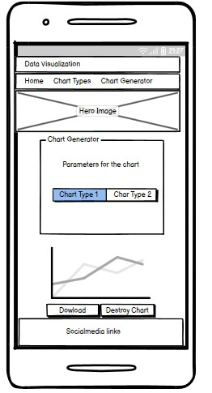

<h1>Data-Visualisation</h1>
Data-Visualisation is a website that allows users to go into depth of importance of Data-Visualisation and what type of charts. Secondly it will contain a chart generator to transform  It will give a detailed timeline of Ceasar political career until his death. it also gives a showcase of legendary battles that influenced his life. View the live site <a href="https://frangidha.github.io/news/index.html" target="_blank" >here</a>

<h3>Features</h3>
<ul>
<li>Site wide</li>
<li>Navigation Menu</li>
<li>CSV reader</li>
<li>Chart Generator</li>
<li>dowload function</li>
<li>Contains links to the Home, Chart Types and Chart Generator and will be responsive on all devices(320px min-width).
This will allow users to easily navigate between the pages within the site on any size device.</li>

</ul>

<h3>Footer</h3>

This will contain icons as links to social media websites that will open in new tabs. Icons will be accessible to the visually impaired who may be using a screen reader, by the use of aria labels. 
This will allow the user to go to various social media where they can share the website. 

<h3>Landing Page</h3>

Landing page image
This is an abstract images that will let think about data visualization and why it important. 
This will help to immediately show the user what the website is about.

<h3>Website information on 'Home'</h3>

Information about Data Visualisation and how to format your data and the websites purpose including an images of how to format your data in excel and text editor and turn them into a CSV.
This information lets the user know what the site is about.

 

explains why CSV files are often used. Secondly how to structure them for usage

a shortcut to start creating charts

<h3>Website information on 'Chart Types'</h3>

It will explain which chart types are good for which applications. (barchart,piechart, lineplot and scatterplot) 

<h3>Website information on 'Chart Generator'</h3>

this page contains a form to convert your CSV-file into a charts and choosing the type of chart you would like

this shows the 2 buttons how to download your made charts and make new one by making free the canvas

<h3>Existing Features</h3>
<ul>
<li>Responsive design</li>
<li>navigation menu</li>
<li>Hidden interactive sections on Chart Type page</li>
<li>information about different type of charts</li>
<li>CSV reader</li>
<li>Chart renderer</li>
<li>Page animations</li>
<li>check if </li>
<li>download the created chart</li>
<li>404 page</li>
</ul>

<h3>404 page</h3>
an error page has been developped in case links are missing or wrong. it has a button that will bring you back to the landing page.

<h3>Features Left to Implement</h3>
<ul> 
<li>Changing favicon of the scatterplot</li>
<li>making it possible to have line chart that have more axes</li>
<li>increase the different types of charts can be generated</li>
</ul>

<h3>Design</h3>
<h4>website design</h4>

Home page

Chart Type

Chart Generator

<h4>phone design</h4>

Home page

Chart Type

Chart Generator

<h3>Technologies</h3>
<ul>
<li>HTML</li>

The structure of the Website was developed using HTML as the main language.

<li>CSS</li>

The Website was styled using custom CSS in an external file.

<li>Javascript</li>

The chart generator and chart type animition were created using JavaScript in an external file.

<li>Visual Studio Code</li>

The website was developed using Visual Studio Code IDE

<li>GitHub </li>

Source code is hosted on GitHub and delpoyed using Git Pages.

<li>Git </li>

Used to commit and push code during the development opf the Website

<li>Font Awesome</li>

Icons obtained from https://fontawesome.com/ were used as the Social media links in the footer section.

<li>balsamiq</li>

wireframes were created using balsamiq from https://balsamiq.com/wireframes/desktop/#

<li>Favicon.io</li>

favicon files were created at https://favicon.io/favicon-converter/

<li>Chart.JS</li>

Graph were created using chart.js libaries https://www.chartjs.org/docs/latest/

</ul>
<h3>Testing</h3>
<h4>Responsiveness</h4>

All pages were tested to ensure responsiveness on screen sizes from 500px and upwards as defined in WCAG 2.1 Reflow criteria for responsive design on Chrome, Edge, Firefox and Opera browsers.

Steps to test:

<ul>
<li>Open browser and navigate to Data Visualazation</li>
<li>Open the developer tools (right click and inspect)</li>
<li>Set to responsive and decrease width to 320px</li>
<li>Set the zoom to 50%</li>
<li>Click and drag the responsive window to maximum width</li>
</ul>

Expected:

Website is responsive on all screen sizes and no images are pixelated or stretched. No horizontal scroll is present. No elements overlap.(chrome,edge) 

Actual:

Website behaved as expected.

Website was also opened on the following devices and no responsive issues were observed

<ul>
<li>iPhoneSE</li>
<li>Samsung Galaxy S8</li>
<li>iPad Air</li>
<li>Samsung Galaxy A51/71</li>
<li>Nest Hub Max</li>
</ul>

<h4>Testing was focused to ensure the following criteria were met:</h4>

Color contrasts meet a minimum ratio as specified in WCAG 2.1 Contrast Guidelines
Heading levels are not missed or skipped to ensure the importance of content is relayed correctly to the end user
All content is contained within landmarks to ensure ease of use for assistive technology, allowing the user to navigate by page regions
All not textual content had alternative text or titles so descriptions are read out to screen readers
HTML page lang attribute has been set
Aria properties have been implemented correctly
WCAG 2.1 Coding best practices being followed
Manual tests were also performed to ensure the website was accessible as possible and an accessibility issue was identified.

Issue #1: background images didn't display 

Fix: changed the absolute path way to a relative pathway

<h4>Chart Funtionalities</h4>
<h5>Chart Generation Scatterplot</h5>

Steps to test:

<ul>

<li>Open browser and navigate to Data Visualazation</li>
<li>Navigate to the Chart Generator</li>
<li>Upload (TestingCSVExcelScatterplot.csv or TestingCSVWordpadScatterplot.txt)</li>
<li>Type in header, X-axes, Y-axes</li>
<li>Select a type of Chart</li>
<li>Click the Generate Button</li>
</ul>

Expected:

Chart is being generated 

Actual:

Chart is being generated

<h5>Chart Delimiter</h5>

Steps to test:

<ul>

<li>Open browser and navigate to Data Visualazation</li>
<li>Navigate to the Chart Generator</li>
<li>Upload (TestingCSVdelimtercomma.txt)</li>
<li>Select the comma(,) delimiter</li>
<li>Type in header, X-axes, Y-axes</li>
<li>Select a type of Scatterplot</li>
<li>Click the Generate Button</li>
</ul>

Expected:

Chart is being generated 

Actual:

Chart is being generated

<h5>Data pop up</h5>

Steps to test:

<ul>

<li>Open browser and navigate to Data Visualazation</li>
<li>Navigate to the Chart Generator</li>
<li>Upload (badCSVfile.csv)</li>
<li>Select the comma(;) delimiter</li>
<li>Type in header, X-axes, Y-axes</li>
<li>Select a type of Scatterplot</li>
<li>Click the Generate Button</li>
</ul>

Expected:

pop up

Actual:

<h5>Chart Generation(Barchart, Piechart and Lineplot)</h5>

Steps to test:

<ul>

<li>Open browser and navigate to Data Visualazation</li>
<li>Navigate to the Chart Generator</li>
<li>Upload (TestingCSVExcel.csv or TestingCSVWordpad.txt)</li>
<li>Type in header, X-axes, Y-axes</li>
<li>Select a type of Chart</li>
<li>Click the Generate Button</li>
</ul>

Expected:

Chart is being generated with titel and axes titles

Actual:

Chart is being generated with titel and axes titles

<h5>Download and Discard buttons</h5>

Steps to test:

<ul>

<li>First Generate a chart(see Chart Generation)</li>
<li>Click the Chart Discard button</li>
<li>Click the Generate Button</li>
<li>Click the Dowload Button </li>
</ul>

Expected:

Chart will be present afterwards it will be remove from the canvas using the Chart destroy button. You will regenerate the Chart. now the dowload button is clicked and the downloaded as a PNG

Actual:

Chart is being destroyed. Regenerated followed by a download as a PNG

<h4>Chart Types</h4>
<h5>Chart Type buttons</h5>

Steps to test:

<ul>

<li>Open browser and navigate to Data Visualazation</li>
<li>Navigate to the Chart Types</li>
<li>Click on the BarChart button</li>
<li>Click on the LinePlot button</li>
<li>Click on the PieChart button</li>
<li>Click on the Scatterplot button</li>
</ul>

Expected:

the text changes in respect to chart type that has been choses by clicking the button

Actual:

the text changes in respect to chart type that has been choses by clicking the button

<h3>lighthouse testing</h3>

<h3>Functional Testing</h3>

<h4>Navigation Links</h4>

Testing was performed to ensure all navigation links on the respective pages, navigated to the correct pages as per design. This was done by clicking on the navigation links on each page.

Navigation Link	Page to Load
Home Page	       index.html
Chart Types      graph.html
Chart Generator	 generator.html

Links on all pages navigated to the correct pages as exptected.

<h4>Footer Social Media Icons / Links</h4>

Testing was performed on the Font Awesome Social Media icons in the footer to ensure that each one opened in a new tab.

Each item opened a new tab when clicked as expected.

<h4>Validator Testing</h4>
<ul>
<li>HTML</li>

No errors were returned when passing through the official W3C validator

index HTML Validator Results

graph HTML Validator Results

generator HTML Validator Results

404 HTML Validator Results

<li>CSS</li>

No errors were found when passing through the official (Jigsaw) validator

CSS Validator Results

stylesheet CSS Validator Results

    

stylesheetgraph CSS Validator Results

    

stylesheetgenerator CSS Validator Results

    

<li>Javascript</li>

No errors were returned when passing through the <a href="https://jshint.com/" target="_blank">JShint validator</a>

A warning appeared for one function as an unused variable but the function is being used directly as an onkeyup event on the destroy Chart and Dowload events.

variables are undefienied because the user will define them.

graph.js

script.js

</ul>

<h3>Unfixed Bugs</h3>
solving the warnings given by JShint validator changing the "For in" to a different method.

<h3>Deployment</h3>
<h4>Version Control</h4>
The site was created using the Visual Studio code editor and pushed to github to the remote repository ‘history’.

The following git commands were used throughout development to push code to the remote repo:

git add <file> - This command was used to add the file(s) to the staging area before they are committed.

git commit -m “commit message” - This command was used to commit changes to the local repository queue ready for the final step.

git push - This command was used to push all committed code to the remote repository on github.

<h4>Deployment to Github Pages</h4>
The site was deployed to GitHub pages. The steps to deploy are as follows:
<ul>
<li>In the GitHub repository, navigate to the Settings tab</li>
<li>From the menu on left select 'Pages'</li>
<li>From the source section drop-down menu, select the Branch: main</li>
<li>Click 'Save'</li>
<li>A live link will be displayed in a green banner when published successfully.</li>
<li>The live link can be found here - <a href="https://frangidha.github.io/news/index.html" Target = "_blank">https://frangidha.github.io/news/index.html</a></li>
 </ul>

<h4>Clone the Repository Code Locally</h4>
Navigate to the GitHub Repository you want to clone to use locally:
<ul>
<li>Click on the code drop down button</li>
<li>Click on HTTPS</li>
<li>Copy the repository link to the clipboard</li>
<li>Open your IDE of choice (git must be installed for the next steps)</li>
<li>Type git clone copied-git-url into the IDE terminal</li>
<li>The project will now of been cloned on your local machine for use.</li>
</ul>
<h3>Credits</h3>
chart.js (<a href="https://www.chartjs.org/" target="_blank">link</a>)
libary was used to make the Charts 
Code insitute
the code insitute curriculum was used to develop the entire website.
GoLinuxCloud (<a href="https://www.golinuxcloud.com/javascript-csv-to-array/#:~:text=Method%2D1%3A%20Use%20split()%20method%20to%20convert%20CSV%20to%20Array,-Before%20we%20go&text=split()%20%2C%20and%20it%20takes,typically%20a%20comma%20(%20%2C%20)." target="_blank">link</a>)
was used to parse the CSV into an array.
Felix Luciano <a href="https://codepen.io/FelixLuciano" target="_blank">link</a> 
the hero text animation were inspired by and adjusted to meet the requirements of the website. 
<h3>Media</h3>

all media were taken form <a href="https://www.shutterstock.com/explore/flex-subscriptions?c3apidt=p68161268801&gclid=EAIaIQobChMI0vGyntaD_AIVjd1RCh05jgE2EAAYASAAEgLsDvD_BwE&gclsrc=aw.ds&kw=free%20pictures">free image sources</a> and <a href="https://venngage.com/blog/data-visualization/">blog of Data-Visualization</a>

